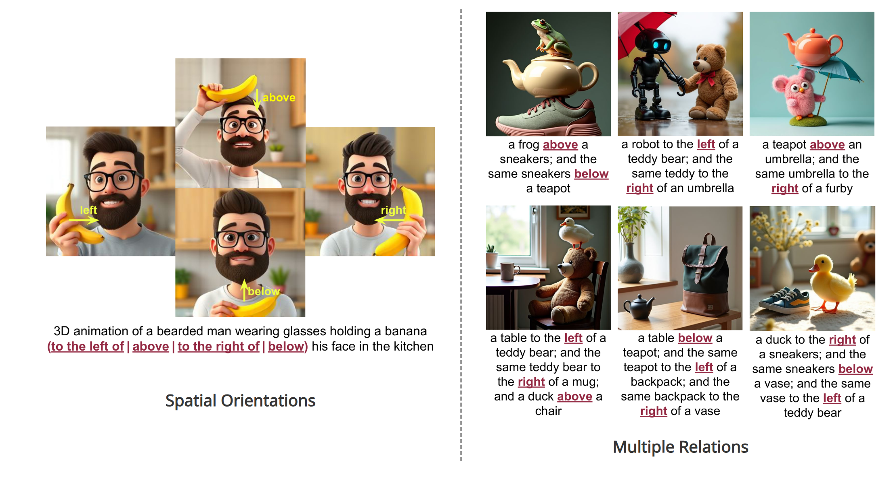

# Learn-to-Steer: Data-Driven Loss Functions for Inference-Time Optimization in Text-to-Image (WACV 2026)
> **Sapir Esther Yiflach, Yuval Atzmon, Gal Chechik**

<a href="https://learn-to-steer-paper.github.io/"></a> 
<a href="https://arxiv.org/abs/2509.02295"></a>

Text-to-image diffusion models can generate stunning visuals, yet they often fail at tasks children find trivial—like placing a dog to the right of a teddy bear rather than to the left. When combinations get more unusual—a giraffe above an airplane—these failures become even more pronounced. Existing methods attempt to fix these spatial reasoning failures through model fine-tuning or test-time optimization with handcrafted losses that are suboptimal. Rather than imposing our assumptions about spatial encoding, we propose learning these objectives directly from the model's internal representations.

We introduce Learn-to-Steer, a novel framework that learns data-driven objectives for test-time optimization rather than handcrafting them. Our key insight is to train a lightweight classifier that decodes spatial relationships from the diffusion model's cross-attention maps, then deploy this classifier as a learned loss function during inference. Training such classifiers poses a surprising challenge: they can take shortcuts by detecting linguistic traces in the cross-attention maps, rather than learning true spatial patterns. We solve this by augmenting our training data with samples generated using prompts with incorrect relation words, which encourages the classifier to avoid linguistic shortcuts and learn spatial patterns from the attention maps. Our method dramatically improves spatial accuracy: from 20% to 61% on FLUX.1-dev and from 7% to 54% on SD2.1 across standard benchmarks. It also generalizes to multiple relations with significantly improved accuracy.


<p align="center">

</p>


## Description  
Official implementation of our "Learn-to-Steer: Data-Driven Loss Functions for Inference-Time Optimization in Text-to-Image" paper (WACV 2026).


## Installation Guide  
```
conda create -n learn_to_steer_env python=3.11.11 -y
conda activate learn_to_steer_env
pip install torch==2.1.2 torchvision==0.16.2 --index-url https://download.pytorch.org/whl/cu118
pip install git+https://github.com/openai/CLIP.git@dcba3cb2e2827b402d2701e7e1c7d9fed8a20ef1 --no-build-isolation
pip install -r requirements.txt
python -m spacy download en_core_web_trf
```


## Checkpoints and Datasets:
For inference, download the checkpoints from [here](https://drive.google.com/drive/folders/1cW67ptuRQgUdzbjFAfjZGYkr_36D3b2W?usp=sharing).
Additionally, Examples of the training dataset can be accessed [here](https://drive.google.com/drive/folders/1Ua5RMsHBWoTNKC5x0ZERZ7gZZLCeNvYk?usp=sharing).

After downloading the weights, place them under `checkpoints/`.

### Datasets Creation and Training:
See [train_relation_classifier/README.md](train_relation_classifier/README.md)


## Run Learn-to-Steer 🌠

**Available Models**:
- `schnell`: FLUX.1-schnell
- `dev`: FLUX.1-dev
- `sd14`: Stable Diffusion 1.4
- `sd2`: Stable Diffusion 2.1

Single Prompt Examples:
```
python run.py \
--prompt "a photo of a dog to the right of a teddy bear" \
--diffusion_version "schnell" \
--relation_classifier_model_path "checkpoints/flux_schnell.pth" \
```

```
python run.py \
--prompt "a photo of a dog to the right of a teddy bear" \
--diffusion_version "dev" \
--relation_classifier_model_path "checkpoints/flux_dev.pth" \
--map_size 32 \
```

### Run Using the Notebook
Run the notebook at `run_examples.ipynb`


## Out-of-Distribution and Multiple Spatial Relations Evaluation for Vision-Language Models
See [ood_multiple_rels_evaluation/README.md](ood_multiple_rels_evaluation/README.md)


## Citation  
If you use this code, please cite our work:
```bibtex
@inproceedings{yiflach2026data,
  title={Data-Driven Loss Functions for Inference-Time Optimization in Text-to-Image},
  author={Yiflach, Sapir Esther and Atzmon, Yuval and Chechik, Gal},
  booktitle={Proceedings of the IEEE/CVF Winter Conference on Applications of Computer Vision},
  pages={3525--3535},
  year={2026}
}
```

## Acknowledgments

- [Prompt-to-Prompt](https://github.com/google/prompt-to-prompt/) for the base Attention Store classes
- [Make-it-Count](https://github.com/Litalby1/make-it-count) for the training pipeline infrastructure
- [Diffusers](https://github.com/huggingface/diffusers) for the diffusion pipeline infrastructure

